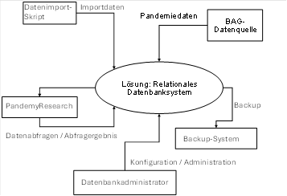
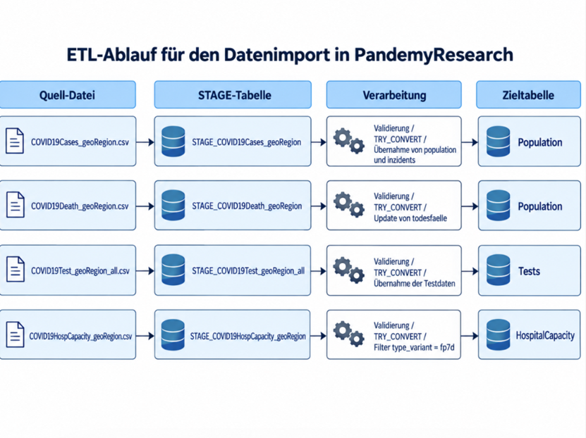
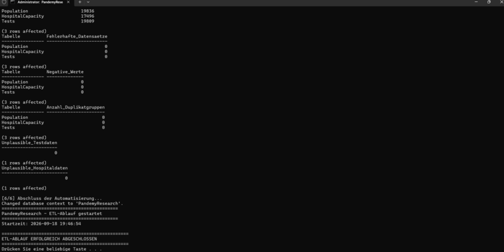
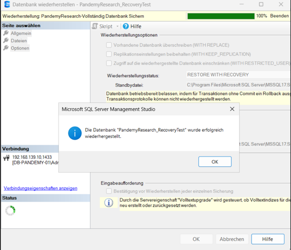
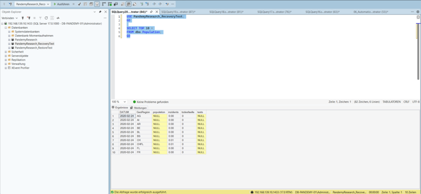

# Windows Server & SQL Server Lab

## Overview

This project documents the planning, implementation and operation of a virtualized Windows Server environment with Microsoft SQL Server.

The project combines server administration, database management, ETL processing, automation, data validation, backup and recovery. The documentation is structured into three project phases covering the complete workflow from planning to operational data processing.

## Technologies

- Windows Server
- VMware Workstation
- Microsoft SQL Server
- SQL Server Management Studio (SSMS)
- SQL
- sqlcmd
- Windows Batch
- Windows Task Scheduler

## What I Implemented

- Planned the database environment and technical workflow
- Created and configured a Windows Server virtual machine
- Installed and configured Microsoft SQL Server and SSMS
- Created and administered a SQL Server database
- Configured users, roles and permissions
- Implemented database backup and recovery procedures
- Created staging tables for external data imports
- Imported CSV data using SQL Server `BULK INSERT`
- Validated and transformed imported data
- Created SQL-based data quality tests
- Implemented database views and stored procedures
- Automated the ETL workflow using Windows Batch and `sqlcmd`
- Configured scheduled execution using Windows Task Scheduler
- Tested the complete ETL and database recovery workflows

## Project Phases

### 1. Planning & Design

The first phase covers the initial planning and definition of the database project, including the system context, project boundaries, process design and project milestones.



Documentation: [`docs/01-planning/`](docs/01-planning/)

### 2. System Implementation

The second phase documents the implementation of the technical environment, including the Windows Server virtual machine, Microsoft SQL Server, database configuration, permissions and the initial backup and recovery setup.

Documentation: [`docs/02-implementation/`](docs/02-implementation/)

### 3. Operations & Data Import

The third phase covers the operational database workflow and ETL process. Source data is imported into staging tables, validated, transformed and transferred into the target database structure.

The workflow also includes automated execution, scheduled processing, database views, stored procedures, backup, restore and recovery testing.



Documentation: [`docs/03-operations-and-data-import/`](docs/03-operations-and-data-import/)

## ETL Workflow

The data processing workflow consists of six SQL steps:

1. Create staging tables
2. Import CSV data
3. Validate imported data
4. Transform data into the target schema
5. Test data quality
6. Complete the automated processing workflow

The individual SQL scripts are executed sequentially through the `PandemyResearch_ETL.bat` automation script using `sqlcmd`.



Detailed scripts and documentation are available in:

- [`SQL scripts`](docs/03-operations-and-data-import/sql/)
- [`Automation`](docs/03-operations-and-data-import/automation/)

## Backup & Recovery

A full database backup and recovery procedure was implemented and tested.

The database backup was restored into a separate recovery-test database. Queries against the restored database were then executed to verify that the recovered data remained accessible and usable.





## Project Structure

```text
windows-server-sql-lab/
├── docs/
│   ├── 01-planning/
│   │   ├── screenshots/
│   │   └── README.md
│   │
│   ├── 02-implementation/
│   │   ├── screenshots/
│   │   ├── architecture.md
│   │   ├── backup-recovery.md
│   │   └── README.md
│   │
│   └── 03-operations-and-data-import/
│       ├── automation/
│       │   ├── PandemyResearch_ETL.bat
│       │   └── README.md
│       ├── screenshots/
│       ├── sql/
│       │   ├── 01_Create_Stage_Tables.sql
│       │   ├── 02_BulkImport.sql
│       │   ├── 03_Validate_Data.sql
│       │   ├── 04_Transform_Data.sql
│       │   ├── 05_Test_Data.sql
│       │   ├── 06_Automation.sql
│       │   └── README.md
│       └── README.md
│
└── README.md
```

## Documentation

The repository contains technical documentation and screenshots demonstrating the implementation and testing of the environment.

Each project phase contains its own documentation and supporting evidence, allowing the complete development from initial planning to database operation and automated data processing to be followed.
