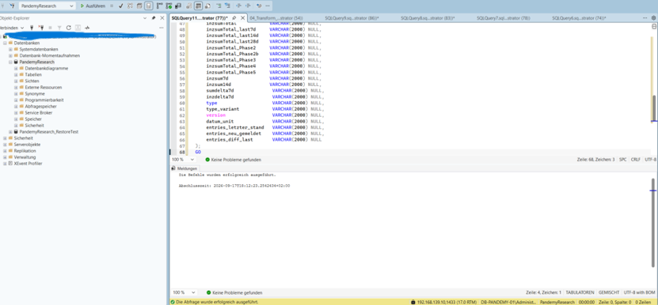
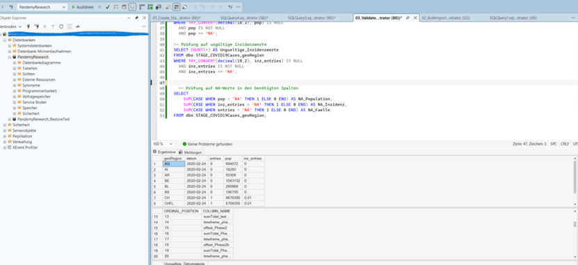
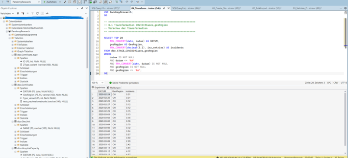
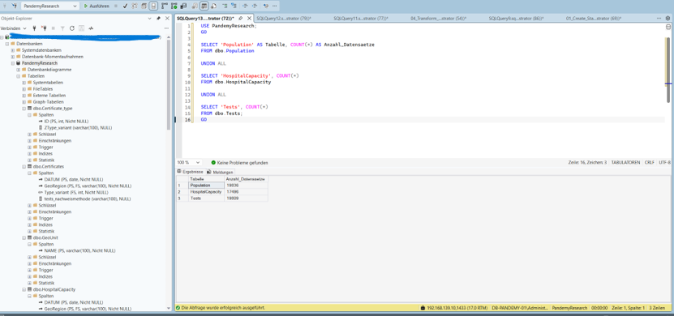
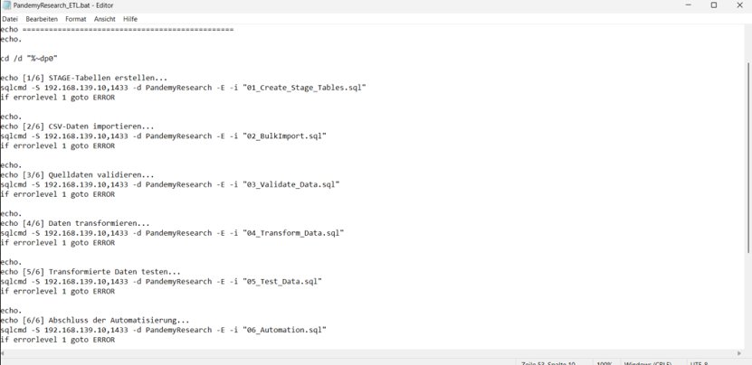
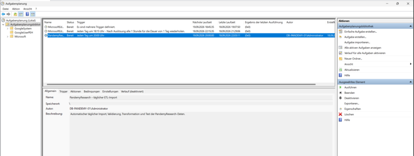
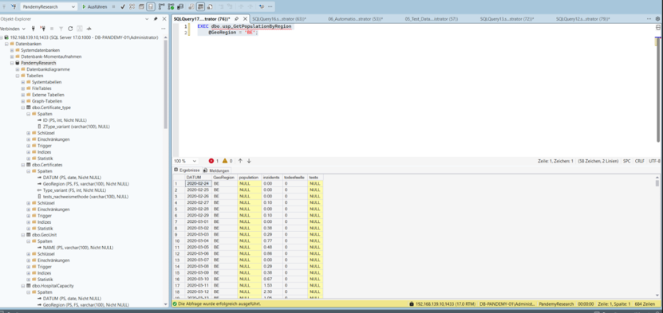
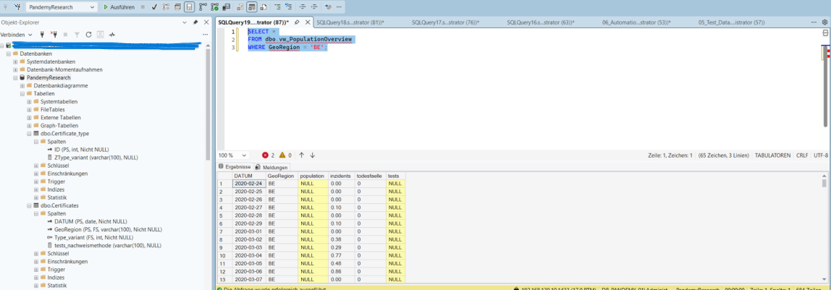
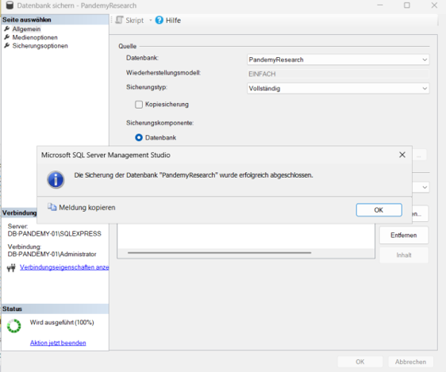

# Operations & Data Import

## Overview

This phase documents the operational use of the PandemyResearch database environment and the import of current pandemic data from official Swiss open-data sources.

The objective was to prepare source data for the PandemyResearch database, import it into Microsoft SQL Server and provide a repeatable process for ongoing data loading, validation and recovery.

## Data Import Process

The data import process follows a staged approach:

1. Analyse the available CSV source files
2. Select the data required by the PandemyResearch data model
3. Create staging tables for the source data
4. Load CSV data into the staging area using SQL Server `BULK INSERT`
5. Validate the imported values
6. Convert source values into the required database data types
7. Transfer the validated data into the PandemyResearch application tables
8. Perform functional checks after the import

### Bulk Import

The source data was loaded into staging tables in Microsoft SQL Server. The staging area separates the original source data from the productive application tables and provides the basis for validation and transformation.

### Data Validation

After the import, the staging data was checked for invalid or missing values before transformation into the target schema.

### Data Transformation

Validated source data was converted and transferred from the staging tables into the corresponding PandemyResearch target tables.

## ETL Workflow

The ETL workflow combines the individual import, validation and transformation steps into a defined processing sequence.

The project contains SQL scripts covering the main processing steps:

- creation of staging tables
- bulk import of CSV files
- validation of imported data
- transformation into the target schema
- data testing
- automation of the processing workflow

The scripts are available in the `sql/` directory.

### Transformation Results

After transformation, the target tables were checked to verify that data had been transferred successfully.

## Automation

The SQL processing workflow can be executed sequentially using the `PandemyResearch_ETL.bat` batch script.

The batch process executes the required SQL scripts in the correct order and provides a repeatable ETL process.

A successful execution of the complete ETL workflow confirms that the individual processing steps can be executed sequentially.

The automation script is available in the `automation/` directory.

### Scheduled Execution

The ETL process can be scheduled using Windows Task Scheduler to support recurring execution of the data-import workflow.

## Database Operations

### Stored Procedure

Database-side processing can also be encapsulated in stored procedures to provide reusable operations within SQL Server.

### Database View

A database view provides structured access to processed PandemyResearch data and can be used for queries without directly accessing the underlying tables.

## Backup & Recovery

Database backup and recovery procedures were tested to verify that the PandemyResearch database can be protected and restored.

### Database Backup

A full database backup was created successfully using Microsoft SQL Server Management Studio.

### Database Restore

The backup was restored into the separate `PandemyResearch_RecoveryTest` database to verify the recovery procedure without overwriting the original database.

### Recovery Test

After restoration, data from the restored `PandemyResearch_RecoveryTest` database was queried successfully. This verifies that the restored database is accessible and contains usable application data.

## Operations Documentation

The operational documentation covers:

- hardware and software components
- database operation and administration
- database start, stop and restart procedures
- backup and recovery
- application data model
- data-import model
- data-import procedure and scripts
- automated ETL execution

## Project Context

This phase builds on the database environment created during the previous implementation phase.

Together, the three project phases document the complete workflow:

1. **Planning & Design** – evaluation and project planning
2. **System Implementation** – server and database implementation
3. **Operations & Data Import** – operation, data loading, validation, automation and recovery
