# Project Screenshots

This section provides visual documentation of the Windows Server and Microsoft SQL Server lab environment.

The project covers the configuration of a virtualized Windows Server, network and firewall configuration, SQL Server administration, database security, testing, backup, and recovery.

## Environment Setup

### Virtual Machine

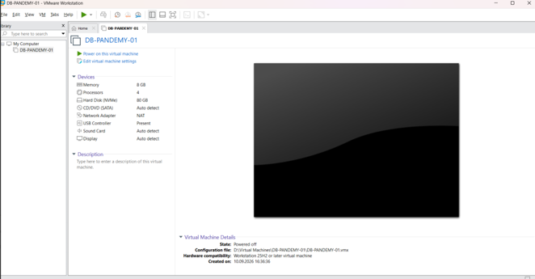

Windows Server virtual machine configured in VMware Workstation for the database environment.

### Windows Server

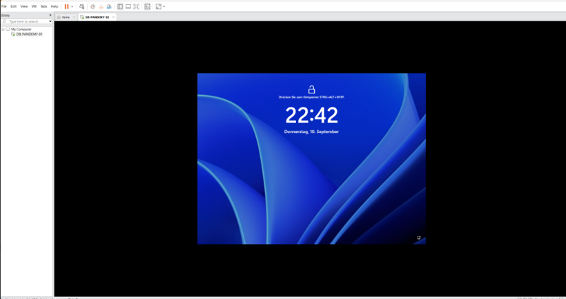

Windows Server environment used to host and administer the Microsoft SQL Server database system.

## Network Configuration

### Network Configuration

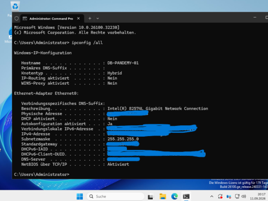

Network configuration of the Windows Server environment.

### Firewall Configuration

Windows Defender Firewall configuration used to allow the required SQL Server network communication.

### SQL Server Network Configuration

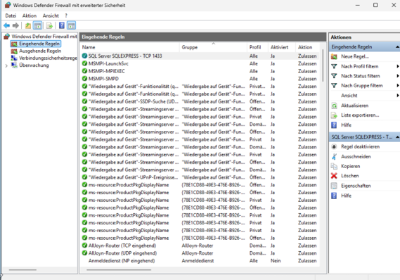

SQL Server TCP/IP network configuration for database connectivity.

## SQL Server and Database

### SQL Server Installation

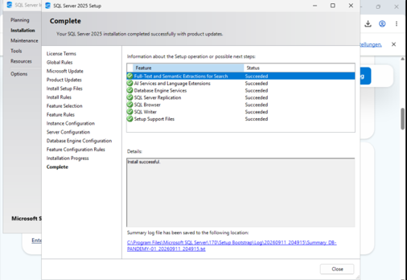

Successful installation of Microsoft SQL Server and the required database services.

### Database Structure

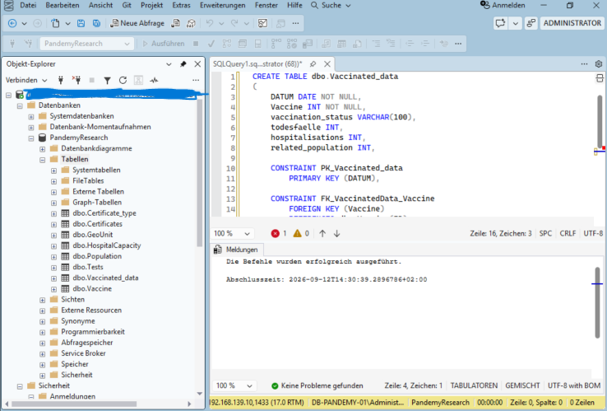

Implementation of the relational database structure in Microsoft SQL Server Management Studio.

### Database Schema

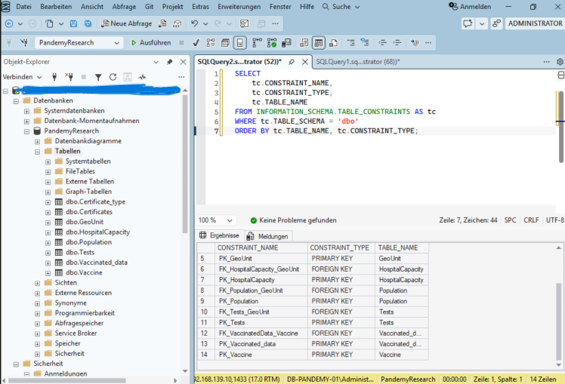

Verification of primary and foreign key constraints within the database schema.

### User Permissions

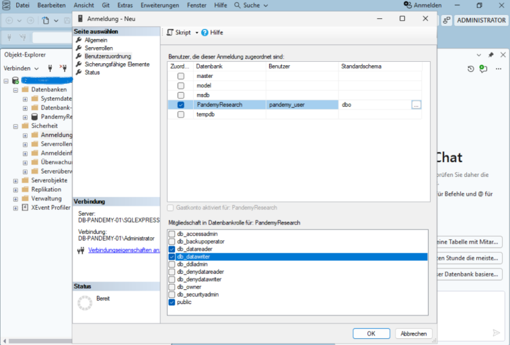

Database user configuration and role assignment demonstrating controlled access to the PandemyResearch database.

### Database Storage

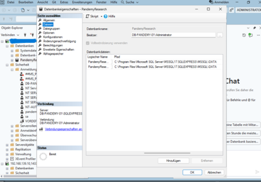

Configuration of the database data and transaction log storage.

## Testing and Validation

### Database Functionality Test

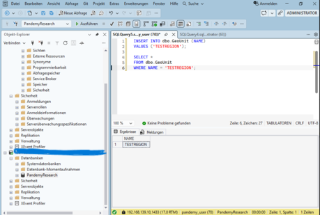

Functional SQL test used to verify database access and data operations.

### Database Integrity Check

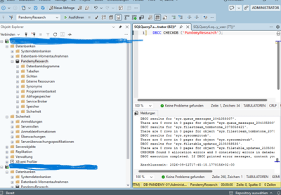

Database integrity verification using SQL Server DBCC CHECKDB.

## Backup and Recovery

### Database Backup

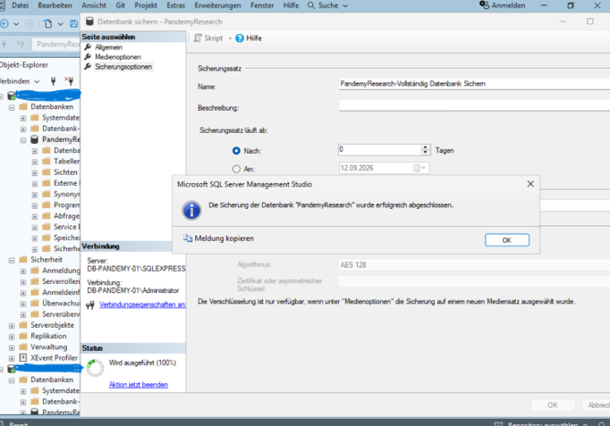

Successful backup of the PandemyResearch database.

### Database Restore

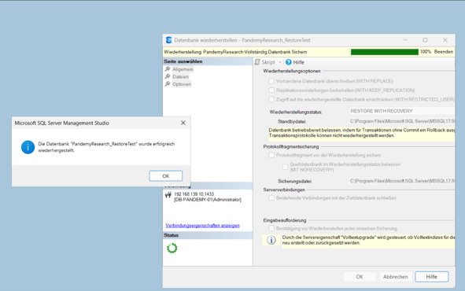

Successful restoration of the database into a separate recovery test database.

### Recovery Test

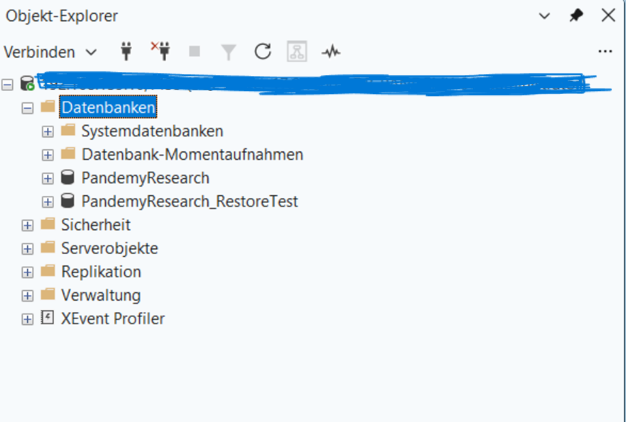

Verification of the restored `PandemyResearch_RestoreTest` database after the recovery procedure.

---

These screenshots document the practical implementation and testing of the Windows Server and SQL Server environment. Additional SQL scripts and technical documentation are available in the repository.
